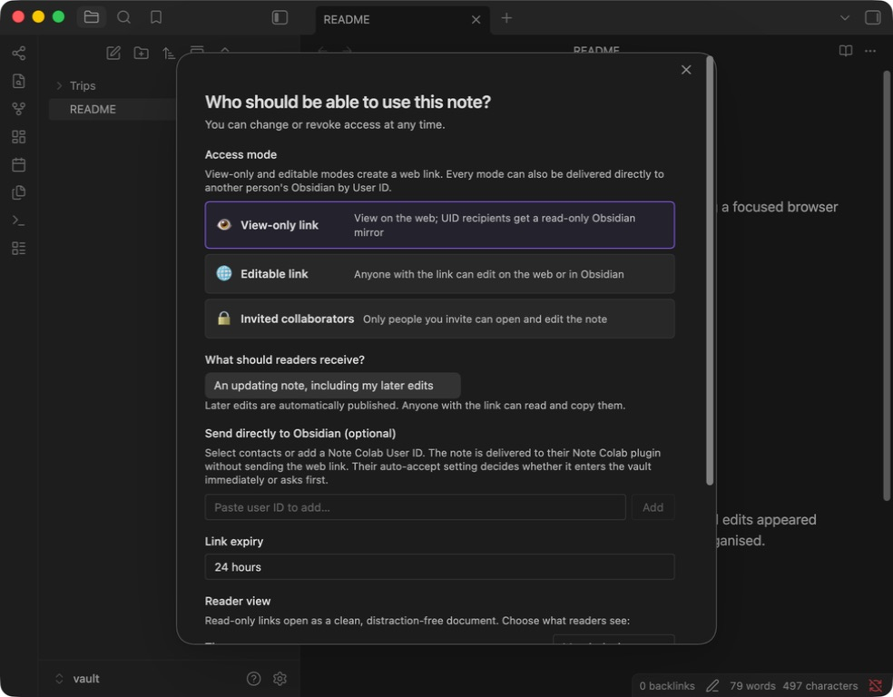
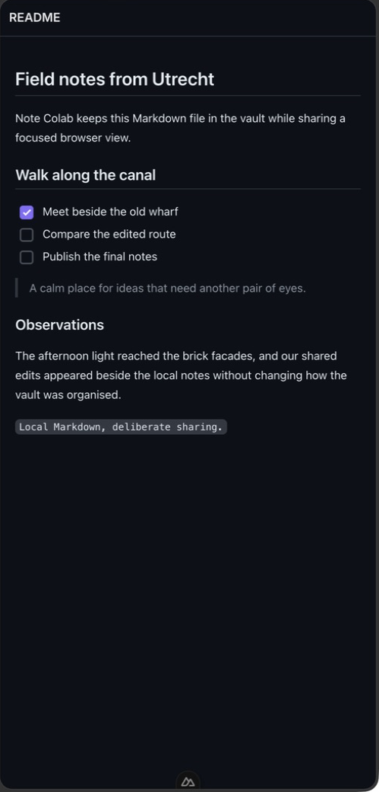
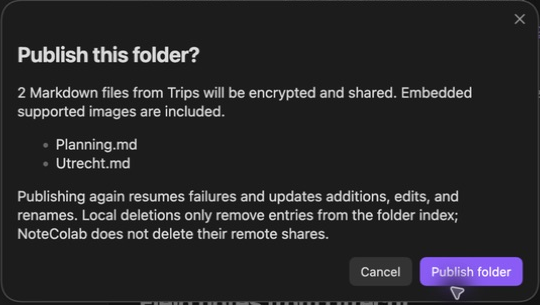

# Note Colab

[Install from Community Plugins](obsidian://show-plugin?id=notecolab) · [Guide](https://notecolab.com/help) · [Status](https://notecolab.com/status) · [Source](https://github.com/felixleopold/notecolab)

Share a Markdown note as a clean web page, send it directly to another Obsidian
vault, or edit it together in real time.

Note Colab keeps your working copy in Obsidian. Recipients can use a browser or
import the note into their own vault.



## Install

1. In Obsidian, open **Settings → Community plugins**.
2. Select **Browse** and search for **Note Colab**.
3. Select **Install**, then **Enable**.
4. Review the first-use explanation and select **Connect to notecolab.com**.

The hosted service does not require an email address or password for your first
share. You can connect to a compatible self-hosted server from Note Colab
settings instead.

## Share your first note

1. Open a Markdown note.
2. Open the command palette with **Ctrl/Cmd+P**.
3. Run **Note Colab: Share note**.
4. Choose an access mode and, when available, an expiry.
5. Select the share action and send the complete link.

You can also open the Note Colab dashboard from the ribbon and select **Share
current note**.

| Access mode | Best for | Who can open it |
| --- | --- | --- |
| **View-only link** | Publishing a clean reader or delivering a locked, updating vault copy | Anyone with the complete link |
| **Editable link** | Fast collaboration in Obsidian or a browser | Anyone with the complete link |
| **Invited collaborators** | Access tied to specific Note Colab identities | People you invite on the same server |

Note Colab adds `colab_*` properties to shared-note frontmatter. Keep these
properties. They identify the server copy and let the plugin reconnect to it.
The `colab_encryption_key` and complete `colab_link` contain access secrets.
They are visible in Properties and source mode and are included in vault backups.
Close Properties before recording or screen sharing, and never publish the raw
frontmatter. Note Colab excludes these properties from its shared content.

## Open a shared note

- **In a browser:** open the complete link to read or edit according to its
  permission.
- **In Obsidian:** run **Note Colab: Import shared note** and paste the link.
- **Direct delivery:** accept the notification in Obsidian. You can opt into
  automatic imports in settings.

A directly delivered view-only note is a locked mirror that follows the owner's
version. Run **Create editable copy of read-only note** to make an independent
local copy.

Links can point to another Note Colab server. The plugin shows that server and
asks before connecting. Direct invitations require both identities to be on the
server hosting the note.

<details>
<summary>See the browser reader</summary>



</details>

## Work together and manage access

Editable notes synchronize while they are open. Collaborator cursors and the
bottom-right presence indicator show who is currently in the active note. Public
usernames are optional. Presence is temporary and is not an activity history or
an authorization signal.

Useful commands:

- **Manage shared links** creates, copies, expires, or revokes individual links.
- **Stop share sync** stops the live connection without removing the share.
- **Revoke note share** removes the server copy and disables its links.
- **Open dashboard** lists notes you own and notes shared with you, along with
  collaborators and storage use.

## Saving, reconnecting, and recovery

The status bar distinguishes saving, saved on this device, saved to the server,
and pending offline changes. Editable notes use encrypted local collaboration
checkpoints and retry server saves after reconnection. A stale server snapshot
is merged rather than silently replacing a newer version. Older installed
clients do not have this protection, so update every collaborating device.

Obsidian Markdown remains your working copy. Keep normal vault backups. When quota permits, one
previous encrypted server version is retained for recovery, not a full history.
Run **Recover previous shared note version to new file** to inspect it in an
independent, unshared file. Browser editors can restore the previous version
after confirmation; that restoration changes the shared note.

## Publish a folder

Run **Note Colab: Share folder**, enter a vault-relative folder path, choose
read-only or editable access, then review the file list before publishing.
Note Colab recursively publishes Markdown files and supported embedded images,
plus an encrypted folder index for recipients.



While Obsidian is open, the plugin watches published folders for additions, edits,
and renames. Editable notes still need their normal per-note live connection.
Run the command again to resume a partial failure. Recipients can run **Import
shared folder**, preview its files, and choose to watch for new additions. New
files require approval; existing unrelated files are never overwritten.

**Manage watched shared folders** stops or resumes folder-index updates and
recipient watching. Already-shared notes keep their own synchronization settings.
It does not revoke published shares. Local deletions disappear
from the next folder index but do not
delete their remote note shares. Revoke old remote notes individually when
needed.

## Publishing without surprises

The share dialog previews the Markdown body before upload. Properties are excluded,
but Markdown comments and embedded content may still contain private information.
Review the preview and linked images before sharing.

For view-only links, choose an updating note or a snapshot. A snapshot publishes
that version without automatically uploading later edits. To replace a snapshot,
revoke it and publish a new share. Existing updating links keep their behavior.

## Plans and hosting

The hosted server reports its current limits in the plugin and on the
[pricing page](https://notecolab.com/pricing). Named collaborators count once
across an owner's notes; public-link visitors do not use collaborator seats.
Only the owner needs an upgrade, when upgrades are offered.

Paid periods are not a promise of permanent storage. Our
[proposed hosting policy](docs/HOSTING-POLICY.md) describes honoring paid-through
dates, retirement notice, and an export window. It is a draft for new paid plans;
automatic quota-expiry deletion is not enabled.

## Your identity

Open **Settings → Note Colab** to see your User ID, trusted contacts, server,
sharing defaults, and storage status.

- Your User ID is safe to give to collaborators. Your API key is not.
- An optional public username helps collaborators recognize you.
- Trusted-contact aliases stay in your vault.
- A NoteColab password supports UID login, vault unlocking, and account recovery.
- If your server offers Google or GitHub sign-in, you can link it in Settings.
  Only providers configured by that server appear.

Before buying storage, save your full User ID and set a web password. Together,
they can restore the same identity, notes, and plan after reinstalling the
plugin or moving to another vault.

Provider sign-in and encryption recovery are separate. OAuth can open your
account and creates its own revocable browser session, but it cannot unlock
encrypted vault keys or silently replace this plugin's API key or X25519 key.
Keep your User ID and NoteColab password for recovery.

Changing **Server URL** creates a separate identity. It does not move shares,
contacts, account settings, or plans between servers.

## Security and privacy

Note Colab has two distinct content paths:

- Current clients encrypt REST-stored Markdown, titles, and supported images on
  your device with AES-256-GCM before upload. The note key is after `#` in the
  share URL and is not included in ordinary HTTP requests.
- Live Yjs collaboration text is decrypted and visible to the relay while the
  room is active.

The service can also see metadata such as share identifiers, permissions,
timestamps, expiry, sizes, collaborators, image filenames, and MIME types.
Legacy notes may retain a plaintext title until a current owner client updates
them. Note Colab is therefore not wholly zero-knowledge or end-to-end encrypted.

A complete link is a capability. Anyone with a view-only link can read and copy
the content. Anyone with an editable link can also change it. Protect your vault
and backups because plugin data and shared-note frontmatter contain credentials
or note keys.

The plugin has no advertising or product analytics telemetry. Use HTTPS and a
server you trust. Read the current security explanation at
[notecolab.com/security](https://notecolab.com/security).

## Troubleshooting

- **Share note is unavailable:** make sure a Markdown note is open and active.
- **Connection fails:** check the Server URL in Note Colab settings and try
  again. Hosted-service readiness is shown at
  [notecolab.com/status](https://notecolab.com/status).
- **An invitation cannot be accepted:** confirm both identities use the server
  hosting the note.
- **Typing disappears while another sync plugin is active:** update SimpleSync
  to version 0.1.28 or later on affected devices, then test with a disposable
  shared note.

For more guidance, visit [notecolab.com/help](https://notecolab.com/help). To
report a bug or request a feature, [open a GitHub
issue](https://github.com/felixleopold/notecolab/issues). Never post private
notes, complete share links, API keys, or recovery material.

The project and hosted service are maintained by [Felix Mrak](https://felixmrak.com).
For support, privacy, or account questions, email
[contact@felixmrak.com](mailto:contact@felixmrak.com).

## Self-hosting

To use a compatible self-hosted service:

1. Open **Settings → Note Colab**.
2. Enter the server origin, for example `https://notes.example.com`. Do not add
   `/api/v1`.
3. Select **Connect** and enter a registration code if requested.
4. Confirm that a new User ID appears, then test a disposable share.

Identities and direct invitations are scoped to one server.

To run the API, web reader, and relay yourself, use the
[self-hosting guide](docs/SELF-HOSTING.md). The
[protocol](docs/PROTOCOL.md) and [security model](SECURITY-CONSIDERATIONS.md)
explain interoperability and the limits of client encryption.

## Development

Use a separate test vault. This package uses Node.js 22 and npm.

```sh
npm ci
npm test
npm run build
```

Copy the build output into the test vault's
`.obsidian/plugins/notecolab/` directory, then reload Obsidian.

## License

The plugin, API, relay, and web client are available under the Apache License 2.0. Source and releases
are at [github.com/felixleopold/notecolab](https://github.com/felixleopold/notecolab).
